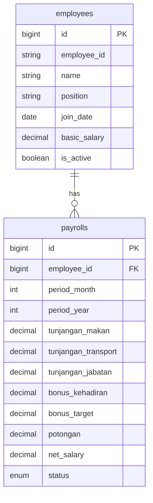

# Rancangan Modul Penggajian Sederhana

> Modul minimalis untuk **1-10 pegawai** - fokus pada kemudahan penggunaan.

---

## 1. Struktur Database

### Tabel `employees` (Pegawai)

| Kolom | Tipe | Keterangan |
|-------|------|------------|
| id | BIGINT (PK) | Primary key |
| employee_id | VARCHAR(20) | No ID karyawan (P001, P002, dll) |
| name | VARCHAR(100) | Nama lengkap |
| position | VARCHAR(50) | Jabatan |
| join_date | DATE | Tanggal bergabung |
| basic_salary | DECIMAL(15,2) | Gaji pokok |
| bank_name | VARCHAR(50) | Nama bank (opsional) |
| bank_account | VARCHAR(30) | No. rekening (opsional) |
| is_active | BOOLEAN | Status aktif |
| created_at | TIMESTAMP | |
| updated_at | TIMESTAMP | |

---

### Tabel `payrolls` (Slip Gaji)

| Kolom | Tipe | Keterangan |
|-------|------|------------|
| id | BIGINT (PK) | Primary key |
| employee_id | BIGINT (FK) | Relasi ke employees |
| period_month | TINYINT | Bulan (1-12) |
| period_year | SMALLINT | Tahun |
| **Gaji Pokok** | | |
| basic_salary | DECIMAL(15,2) | Gaji pokok |
| **Tunjangan** | | |
| tunjangan_makan | DECIMAL(15,2) | Tunjangan makan |
| tunjangan_transport | DECIMAL(15,2) | Tunjangan transport |
| tunjangan_jabatan | DECIMAL(15,2) | Tunjangan jabatan |
| **Bonus** | | |
| bonus_kehadiran | DECIMAL(15,2) | Bonus kehadiran |
| bonus_target | DECIMAL(15,2) | Bonus target |
| **Potongan** | | |
| potongan | DECIMAL(15,2) | Total potongan |
| potongan_notes | TEXT | Catatan potongan |
| **Total** | | |
| net_salary | DECIMAL(15,2) | Gaji bersih |
| status | ENUM | `draft`, `paid` |
| paid_at | DATE | Tanggal dibayar |
| created_at | TIMESTAMP | |
| updated_at | TIMESTAMP | |

---

## 2. ERD



---

## 3. Fitur

| Fitur | Deskripsi |
|-------|-----------|
| ✅ Kelola Pegawai | Tambah, edit, hapus data pegawai |
| ✅ Buat Slip Gaji | Input gaji bulanan per pegawai |
| ✅ Tunjangan Terpisah | Makan, Transport, Jabatan |
| ✅ Bonus Terpisah | Kehadiran, Target |
| ✅ Cetak Slip | Export slip gaji ke PDF |
| ✅ Riwayat | Lihat histori gaji per pegawai |

---

## 4. Contoh Form Input Pegawai

```
┌─────────────────────────────────────────────────┐
│  DATA KARYAWAN                                  │
├─────────────────────────────────────────────────┤
│  No ID:           [ P001 ]                      │
│  Nama:            [ Ahmad Budiman ]             │
│  Jabatan:         [ Staff Operasional ]         │
│  Tanggal Gabung:  [ 01/01/2024 ]                │
│  Gaji Pokok:      Rp [ 5.000.000 ]              │
│                                                 │
│  Bank:            [ BCA ] (opsional)            │
│  No. Rekening:    [ 1234567890 ] (opsional)     │
│                                                 │
│  [ Simpan ]                                     │
└─────────────────────────────────────────────────┘
```

---

## 5. Contoh Form Input Slip Gaji

```
┌─────────────────────────────────────────────────┐
│  BUAT SLIP GAJI                                 │
├─────────────────────────────────────────────────┤
│  Pegawai:     [ Ahmad Budiman (P001) ▼ ]        │
│  Periode:     [ Februari ▼ ] [ 2026 ▼ ]         │
│                                                 │
│  GAJI POKOK                                     │
│  Gaji Pokok:      Rp  5.000.000  (auto)         │
│                                                 │
│  TUNJANGAN                                      │
│  Tunjangan Makan:     Rp [   300.000 ]          │
│  Tunjangan Transport: Rp [   500.000 ]          │
│  Tunjangan Jabatan:   Rp [   200.000 ]          │
│                                                 │
│  BONUS                                          │
│  Bonus Kehadiran:     Rp [   150.000 ]          │
│  Bonus Target:        Rp [   250.000 ]          │
│                                                 │
│  POTONGAN                                       │
│  Total Potongan:      Rp [   100.000 ]          │
│  Catatan:             [ Kasbon ]                │
│                                                 │
│  ─────────────────────────────────────────────  │
│  GAJI BERSIH:         Rp 6.300.000              │
│                                                 │
│  [ Simpan Draft ]  [ Simpan & Cetak ]           │
└─────────────────────────────────────────────────┘
```

**Rumus:**
```
Gaji Bersih = Gaji Pokok 
            + Tunj. Makan + Tunj. Transport + Tunj. Jabatan
            + Bonus Kehadiran + Bonus Target
            - Potongan
```

---

## 6. Contoh Slip Gaji (PDF)

```
╔═══════════════════════════════════════════════════════╗
║               SLIP GAJI KARYAWAN                      ║
║                Februari 2026                          ║
╠═══════════════════════════════════════════════════════╣
║  No ID     : P001                                     ║
║  Nama      : Ahmad Budiman                            ║
║  Jabatan   : Staff Operasional                        ║
║  Tgl Gabung: 01 Januari 2024                          ║
╠═══════════════════════════════════════════════════════╣
║  PENDAPATAN                                           ║
║  ─────────────────────────────────────                ║
║  Gaji Pokok           :       Rp  5.000.000           ║
║                                                       ║
║  Tunjangan Makan      :       Rp    300.000           ║
║  Tunjangan Transport  :       Rp    500.000           ║
║  Tunjangan Jabatan    :       Rp    200.000           ║
║                                                       ║
║  Bonus Kehadiran      :       Rp    150.000           ║
║  Bonus Target         :       Rp    250.000           ║
║  ─────────────────────────────────────                ║
║  Total Pendapatan     :       Rp  6.400.000           ║
╠═══════════════════════════════════════════════════════╣
║  POTONGAN                                             ║
║  ─────────────────────────────────────                ║
║  Kasbon               : -     Rp    100.000           ║
║  ─────────────────────────────────────                ║
║  Total Potongan       :       Rp    100.000           ║
╠═══════════════════════════════════════════════════════╣
║  GAJI BERSIH          :       Rp  6.300.000           ║
╚═══════════════════════════════════════════════════════╝
```

---

## 7. Contoh Daftar Pegawai

| No ID | Nama | Jabatan | Tgl Gabung | Gaji Pokok | Aksi |
|-------|------|---------|------------|------------|------|
| P001 | Ahmad Budiman | Staff Operasional | 01/01/2024 | Rp 5.000.000 | ✏️ 🗑️ |
| P002 | Siti Aminah | Admin | 15/03/2024 | Rp 4.500.000 | ✏️ 🗑️ |
| P003 | Budi Santoso | Driver | 01/06/2024 | Rp 4.000.000 | ✏️ 🗑️ |

---

## 8. Struktur File Laravel

```
app/
├── Http/Controllers/
│   ├── EmployeeController.php
│   └── PayrollController.php
├── Models/
│   ├── Employee.php
│   └── Payroll.php

database/migrations/
├── create_employees_table.php
└── create_payrolls_table.php

resources/views/payroll/
├── employees/
│   ├── index.blade.php
│   └── form.blade.php
├── payrolls/
│   ├── index.blade.php
│   └── form.blade.php
└── slip.blade.php
```

---

## 9. Estimasi Timeline

| Task | Estimasi |
|------|----------|
| Database + Models | 0.5 hari |
| CRUD Pegawai | 1 hari |
| CRUD Slip Gaji | 1-2 hari |
| Cetak PDF | 0.5 hari |
| **Total** | **3-4 hari** |

---

## 10. Checklist Kebutuhan

| Item | Status |
|------|--------|
| No ID Karyawan | ✅ |
| Nama | ✅ |
| Jabatan | ✅ |
| Tanggal Bergabung | ✅ |
| Gaji Pokok | ✅ |
| Tunjangan Makan | ✅ |
| Tunjangan Transport | ✅ |
| Tunjangan Jabatan | ✅ |
| Bonus Kehadiran | ✅ |
| Bonus Target | ✅ |

---

> **Cocok untuk:** Usaha kecil dengan 1-10 karyawan yang butuh pencatatan gaji sederhana dengan tunjangan & bonus terpisah.
