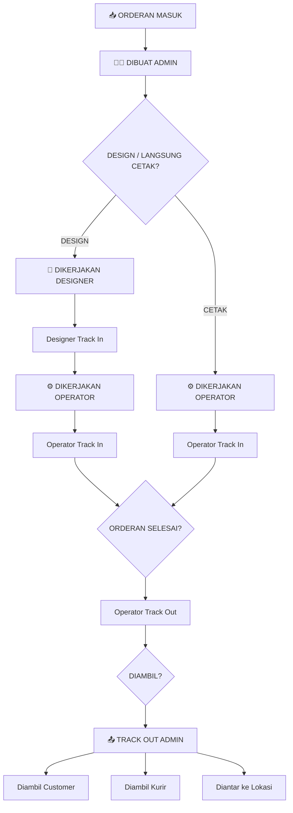

# Modul Monitoring Proses — Implementation Plan

## Deskripsi

Modul baru **Monitoring Process** untuk melacak seluruh siklus hidup orderan dari **Orderan Masuk** hingga **Finish (Diambil)**. Modul ini memungkinkan:
- Admin menginput orderan & mengeluarkan SPK
- Designer melakukan Track In (mulai desain) dan Track Out (selesai desain)
- Operator melakukan Track In (mulai produksi) dan Track Out (selesai produksi)
- Admin melakukan Track Out final + menentukan status pengambilan
- Semua proses tercatat siapa yang mengerjakan, jam berapa mulai, dan jam berapa selesai
- Barcode scanner support untuk Track In / Track Out

---

## Alur Final (Berdasarkan Gambar ke-3)



---

## Sidebar Menu (Sesuai Gambar ke-1)

Menambahkan section baru **MONITORING PROCESS** pada sidebar, antara section Pengeluaran/Kategori dan section Penggajian:

```
MONITORING PROCESS
├── ➡️ Track In Order
├── ⬅️ Track Out Order
└── 📊 Status Order
```

---

## User Review Required

> [!IMPORTANT]
> **Akun Operator/Designer**: Setiap Leader Produksi / Designer akan memiliki **akun User** sendiri (bukan Employee). Akun ini akan diberikan role `operator` atau `designer` dengan permission terbatas hanya untuk fitur Monitoring Process (Track In / Track Out). Apakah ini sesuai?

> [!IMPORTANT]
> **Barcode pada Transaksi**: Saat ini transaksi sudah memiliki `invoice_number` (format: `INV-YYYYMMDD-XXXX`). Barcode akan di-generate dari `invoice_number` ini. Operator/Designer cukup scan barcode di SPK untuk Track In/Track Out. Apakah perlu format barcode terpisah atau cukup pakai `invoice_number`?

> [!WARNING]
> **Perubahan pada tabel `transactions`**: Akan menambahkan kolom baru (`pickup_method`, `picked_up_at`, `picked_up_notes`) pada tabel `transactions` yang sudah ada, serta membuat tabel baru `production_trackings` untuk menyimpan history tracking. Data transaksi lama tidak akan terpengaruh.

---

## Open Questions

1. **Apakah satu orderan bisa dikerjakan lebih dari satu Designer atau hanya satu?**
   Saat ini model Transaction sudah punya `desainer_id` (satu designer). Jika bisa multi-designer, perlu perubahan arsitektur.

2. **Apakah Designer Track Out otomatis menjadi Operator Track In, atau perlu manual?**
   Dari gambar, setelah Designer selesai, Operator masih perlu Track In manual. Saya akan implementasikan manual.

3. **Apakah halaman Track In & Track Out terpisah (sesuai sidebar) atau satu halaman dengan toggle?**
   Dari gambar sidebar, terpisah. Saya akan buat terpisah.

---

## Proposed Changes

### 1. Database Layer

#### [NEW] Migration: `create_production_trackings_table`

Tabel `production_trackings` menyimpan **setiap event** tracking (track in/out oleh siapa dan kapan):

```php
Schema::create('production_trackings', function (Blueprint $table) {
    $table->id();
    $table->foreignId('transaction_id')->constrained()->cascadeOnDelete();
    $table->foreignId('user_id')->constrained()->cascadeOnDelete(); // Siapa yang melakukan
    
    // Tipe tracking
    $table->enum('type', [
        'design_in',      // Designer mulai kerja
        'design_out',     // Designer selesai
        'production_in',  // Operator mulai produksi
        'production_out', // Operator selesai produksi
        'admin_out',      // Admin Track Out final
    ]);
    
    $table->timestamp('tracked_at');     // Jam berapa
    $table->text('notes')->nullable();   // Catatan
    $table->timestamps();
});
```

#### [NEW] Migration: `add_monitoring_fields_to_transactions_table`

Menambahkan kolom pada tabel `transactions`:

```php
$table->enum('pickup_method', ['customer', 'kurir', 'diantar'])->nullable();
$table->timestamp('picked_up_at')->nullable();
$table->string('picked_up_notes')->nullable();
$table->foreignId('checked_by')->nullable()->constrained('users')->nullOnDelete(); // Diperiksa oleh siapa
```

Dan **memperluas enum `order_status`** menjadi:

| Status Lama | Status Baru (Ditambahkan) |
|---|---|
| `pending` | tetap |
| `production` | tetap |
| `completed` | tetap |
| `delivered` | tetap |
| — | `designing` (sedang di-design) |
| — | `finished` (sudah Track Out admin, menunggu diambil) |

> [!NOTE]
> Karena MySQL enum sulit di-alter, kolom `order_status` akan diubah menjadi `string` agar lebih fleksibel menampung status baru.

---

### 2. Model Layer

#### [NEW] [ProductionTracking.php](file:///Users/jumarno-/Desktop/Project/kasir/app/Models/ProductionTracking.php)

```php
class ProductionTracking extends Model {
    protected $fillable = ['transaction_id', 'user_id', 'type', 'tracked_at', 'notes'];
    
    // Relationships
    public function transaction() → belongsTo(Transaction)
    public function user() → belongsTo(User)
    
    // Constants
    const TYPE_DESIGN_IN = 'design_in';
    const TYPE_DESIGN_OUT = 'design_out';
    const TYPE_PRODUCTION_IN = 'production_in';
    const TYPE_PRODUCTION_OUT = 'production_out';
    const TYPE_ADMIN_OUT = 'admin_out';
}
```

#### [MODIFY] [Transaction.php](file:///Users/jumarno-/Desktop/Project/kasir/app/Models/Transaction.php)

- Menambahkan konstanta status baru: `ORDER_STATUS_DESIGNING`, `ORDER_STATUS_FINISHED`
- Menambahkan fillable: `pickup_method`, `picked_up_at`, `picked_up_notes`, `checked_by`
- Menambahkan relationship: `trackings()` → hasMany(ProductionTracking)
- Menambahkan relationship: `checkedBy()` → belongsTo(User, 'checked_by')
- Menambahkan helper methods: `latestDesignIn()`, `latestProductionIn()`, `canTrackIn()`, `canTrackOut()`

---

### 3. Controller Layer

#### [NEW] [MonitoringController.php](file:///Users/jumarno-/Desktop/Project/kasir/app/Http/Controllers/MonitoringController.php)

| Method | Route | Deskripsi |
|---|---|---|
| `trackIn()` | GET `/monitoring/track-in` | Halaman Track In — scan barcode / pilih orderan, lalu klik Track In |
| `storeTrackIn()` | POST `/monitoring/track-in` | Proses Track In (simpan record + update status transaksi) |
| `trackOut()` | GET `/monitoring/track-out` | Halaman Track Out — scan barcode / pilih orderan, lalu klik Track Out |
| `storeTrackOut()` | POST `/monitoring/track-out` | Proses Track Out (simpan record + update status transaksi) |
| `statusOrder()` | GET `/monitoring/status` | Halaman Status Order — tabel monitoring semua orderan |
| `lookupTransaction()` | GET `/monitoring/lookup` | API: lookup transaksi by barcode/invoice_number |

**Logika Track In:**
- Jika user role = `designer` → buat record `design_in`, status → `designing`
- Jika user role = `operator` → buat record `production_in`, status → `production`

**Logika Track Out:**
- Jika user role = `designer` → buat record `design_out`, status tetap `designing` (menunggu operator)
- Jika user role = `operator` → buat record `production_out`, status → `completed`
- Jika user role = `admin` → buat record `admin_out` + set `pickup_method`, status → `finished`

---

### 4. Views Layer

#### [NEW] `resources/views/monitoring/track-in.blade.php`

Halaman **Track In Order**:
- Input barcode scanner (auto-focus, auto-submit on scan)
- Atau dropdown pilih transaksi manual
- Menampilkan detail orderan setelah scan
- Tombol **"TRACK IN"** untuk memulai pengerjaan
- Menampilkan info: Nama Customer, Deskripsi Produk, Tanggal Pembuatan

#### [NEW] `resources/views/monitoring/track-out.blade.php`

Halaman **Track Out Order**:
- Input barcode scanner (auto-focus)
- Atau dropdown pilih transaksi manual
- Menampilkan detail orderan + history tracking
- Untuk admin: pilihan **pickup method** (Diambil Customer / Diambil Kurir / Diantar ke Lokasi)
- Tombol **"TRACK OUT"** untuk menyelesaikan pengerjaan

#### [NEW] `resources/views/monitoring/status.blade.php`

Halaman **Status Order / Monitoring Order** (sesuai gambar ke-2):

| Kolom | Sumber Data |
|---|---|
| Nama Customer | `transaction.customer.name` |
| Deskripsi Produk | `transaction.items` (nama produk + custom_name) |
| Tanggal Pembuatan | `transaction.created_at` |
| Tanggal Design | Dari `production_trackings` type `design_in` |
| Nama Designer | Dari `production_trackings` type `design_in` → user.name |
| Tanggal Produksi | Dari `production_trackings` type `production_in` |
| Nama Produksi | Dari `production_trackings` type `production_in` → user.name |
| Tanggal Selesai | Dari `production_trackings` type `production_out` |
| Nama Pemeriksa | Dari `production_trackings` type `production_out` → user.name |
| STATUS | `pickup_method` + tanggal diambil |

Fitur:
- Filter: Search by barcode/nama customer/nama produk
- Filter: By nama customer (dropdown)
- Sort: By tanggal
- Color-coded status badges
- Real-time status indicator

---

### 5. Routes

#### [MODIFY] [web.php](file:///Users/jumarno-/Desktop/Project/kasir/routes/web.php)

```php
// Monitoring Process
Route::middleware('permission:monitoring_process')->prefix('monitoring')->group(function () {
    Route::get('track-in', [MonitoringController::class, 'trackIn'])->name('monitoring.track-in');
    Route::post('track-in', [MonitoringController::class, 'storeTrackIn'])->name('monitoring.track-in.store');
    Route::get('track-out', [MonitoringController::class, 'trackOut'])->name('monitoring.track-out');
    Route::post('track-out', [MonitoringController::class, 'storeTrackOut'])->name('monitoring.track-out.store');
    Route::get('status', [MonitoringController::class, 'statusOrder'])->name('monitoring.status');
    Route::get('lookup', [MonitoringController::class, 'lookupTransaction'])->name('monitoring.lookup');
});
```

---

### 6. Sidebar Integration

#### [MODIFY] [app.blade.php](file:///Users/jumarno-/Desktop/Project/kasir/resources/views/layouts/app.blade.php)

Menambahkan section **MONITORING PROCESS** pada sidebar (antara section Pengeluaran dan Penggajian):

```html
@can('monitoring_process')
    <p class="section-title">Monitoring Process</p>
    <a href="{{ route('monitoring.track-in') }}" class="nav-link" title="Track In Order">
        <span class="icon">📥</span>
        <span class="label">Track In Order</span>
    </a>
    <a href="{{ route('monitoring.track-out') }}" class="nav-link" title="Track Out Order">
        <span class="icon">📤</span>
        <span class="label">Track Out Order</span>
    </a>
    <a href="{{ route('monitoring.status') }}" class="nav-link" title="Status Order">
        <span class="icon">📊</span>
        <span class="label">Status Order</span>
    </a>
@endcan
```

---

### 7. Permissions & Roles

#### [NEW] Migration/Seeder: `MonitoringPermissionSeeder`

**Permission baru:**

| Name | Display Name |
|---|---|
| `monitoring_process` | Akses Monitoring Process |
| `monitoring_track_in` | Track In Order |
| `monitoring_track_out` | Track Out Order |
| `monitoring_status` | Lihat Status Order |
| `monitoring_admin_out` | Track Out Admin (Final) |

**Role baru:**

| Role | Display Name | Permissions |
|---|---|---|
| `operator` | Operator Produksi | `monitoring_process`, `monitoring_track_in`, `monitoring_track_out` |
| `designer` | Designer | `monitoring_process`, `monitoring_track_in`, `monitoring_track_out` |

**Role yang di-update:**

| Role | Permission Ditambahkan |
|---|---|
| `admin` | Semua monitoring permissions |
| `kepala_toko` | Semua monitoring permissions |
| `finance` | Semua monitoring permissions |
| `manager` | Semua monitoring permissions |

---

### 8. Barcode Support

Barcode menggunakan `invoice_number` transaksi (format: `INV-YYYYMMDD-XXXX`).

Implementasi pada halaman Track In & Track Out:
- **Input field** dengan auto-focus untuk scanner hardware
- Scanner hardware mengirim karakter + Enter → form auto-submit
- Setelah scan, AJAX lookup ke `/monitoring/lookup?barcode=INV-xxx`
- Menampilkan detail transaksi → user klik **Track In** / **Track Out**
- Alternatif: input manual / pilih dari dropdown

Library barcode generation (untuk cetak di SPK): menggunakan library PHP yang sudah tersedia atau CSS-based barcode.

---

## Ringkasan File yang Dibuat/Diubah

| Aksi | File |
|---|---|
| ✅ NEW | `database/migrations/xxxx_create_production_trackings_table.php` |
| ✅ NEW | `database/migrations/xxxx_add_monitoring_fields_to_transactions_table.php` |
| ✅ NEW | `app/Models/ProductionTracking.php` |
| ✅ NEW | `app/Http/Controllers/MonitoringController.php` |
| ✅ NEW | `resources/views/monitoring/track-in.blade.php` |
| ✅ NEW | `resources/views/monitoring/track-out.blade.php` |
| ✅ NEW | `resources/views/monitoring/status.blade.php` |
| ✅ NEW | `database/seeders/MonitoringPermissionSeeder.php` |
| ✏️ MODIFY | `app/Models/Transaction.php` (tambah relationships & status) |
| ✏️ MODIFY | `routes/web.php` (tambah monitoring routes) |
| ✏️ MODIFY | `resources/views/layouts/app.blade.php` (tambah sidebar menu) |

---

## Verification Plan

### Automated Tests
1. Jalankan `php artisan migrate` untuk memastikan migration berhasil
2. Jalankan `php artisan db:seed --class=MonitoringPermissionSeeder` untuk memastikan seeder berjalan
3. Jalankan `php artisan route:list --path=monitoring` untuk verifikasi routes terdaftar

### Manual Verification
1. Login sebagai **Admin** → verifikasi sidebar menampilkan section Monitoring Process
2. Login sebagai **Operator** → verifikasi hanya bisa akses Track In & Track Out
3. Login sebagai **Designer** → verifikasi bisa akses Track In & Track Out
4. Test flow: Scan barcode pada halaman Track In → Track In → cek Status Order → Track Out
5. Test flow admin: Track Out final dengan pilihan pickup method
6. Verifikasi halaman Status Order menampilkan semua kolom sesuai gambar ke-2
